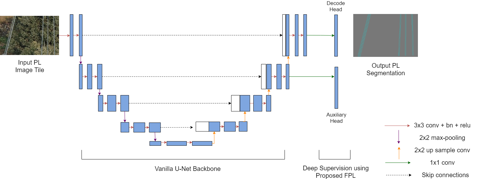

  

 

## Focal Phi Loss with ACU-Net

This repository holds the source code for Focal Phi Loss, a novel loss function for highly imbalanced datasets applied to Power line detection with Auxiliary Classifier U-Net (ACU-Net), by Rabeea Jaffari, Manzoor Ahmed Hashmani and Constantino Carlos Reyes-Aldasoro.

### Prerequisites
Python >= 3.6  
PyTorch == 1.7, tested on CUDA 10.1. The models were trained and evaluated on PyTorch 1.7.
Torch Vision==0.8.1  
Torchaudio==0.7.0
MMSegmentation
MMCCV ==1.1.4  
Other dependencies described in requirements.txt  

### Install
The code in this repo is built using the mmsegmentation framework. For more information on the mmsegmentation framework see:  
https://github.com/open-mmlab/mmsegmentation  
https://mmsegmentation.readthedocs.io/en/latest/  

### Datasets
The two benchmark Power line (PL) datasets used in this research are:
1. Mendeley PL dataset available at: https://data.mendeley.com/datasets/twxp8xccsw/8  
2. Power line dataset of urban scenes (PLDU) available at: https://drive.google.com/drive/folders/1XjoWvHm2I8Y4RV_i9gEd93ZP-KryjJlm  

The train/val splits of these datasets used in the experiments can be found at: [dataset_files](../master/dataset_files)

## Models
Auxiliary Classifier U-Net (ACU-Net)
Vanilla U-NET

## Train and Test Models on PL datasets
To train and test the ACU-Net model on:
  Mendeley dataset [acunet_mendeley](../master/dataset_files)
  PLDU dataset [acunet_pldu](../master/dataset_files)
  
To train and test the Vanilla U-Net model on:
  Mendeley dataset [vanilla_unet_mendeley](../master/dataset_files)
  PLDU dataset [vanilla_unet_pldu](../master/dataset_files)
## License

This project is released under the [Apache 2.0 license](LICENSE).

